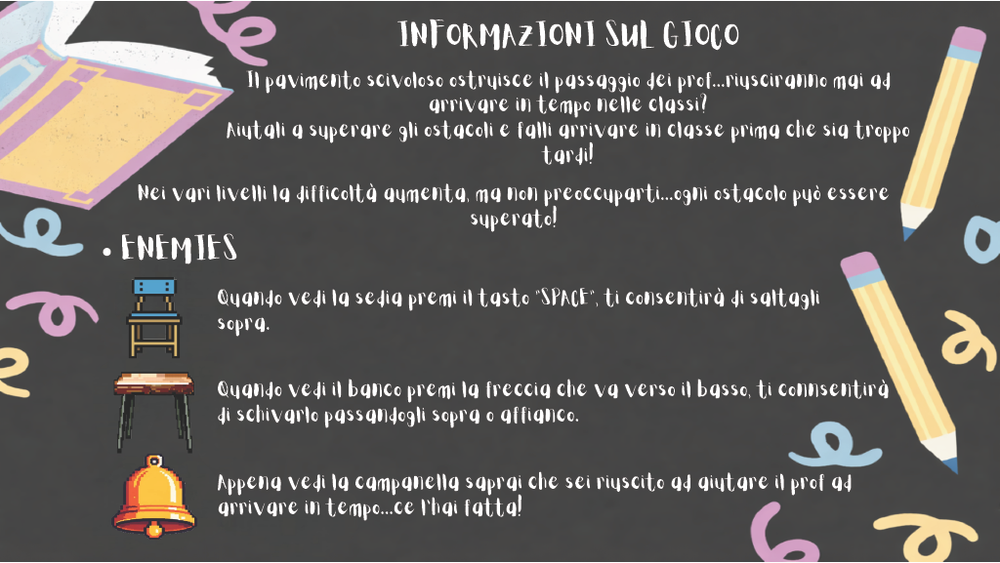

# CorsaAllUltimaCampanella

Viola Alfieri ha generato le immagini dei personaggi con ChatGPT e LeonardoAI mentre Matilde Bottegoni ha ricercato le immagini del banco e della sedia su Shutterstock.
Matilde Bottegoni ha fatto lo sfondo "Hai perso", "Hai vinto", "Informazioni" con Canva, con lo stesso sito Viola Alfieri ha generato la schermata "Home", "Personaggi" e "Livelli". 
Viola Alfieri e Matilde Bottegoni hanno lavorato insieme a tutte le funzioni del file _init_.py.

